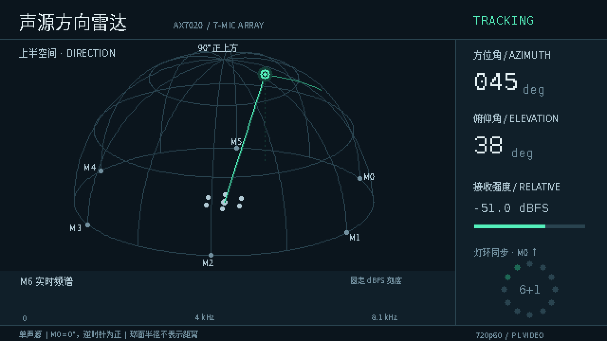
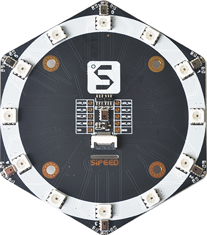
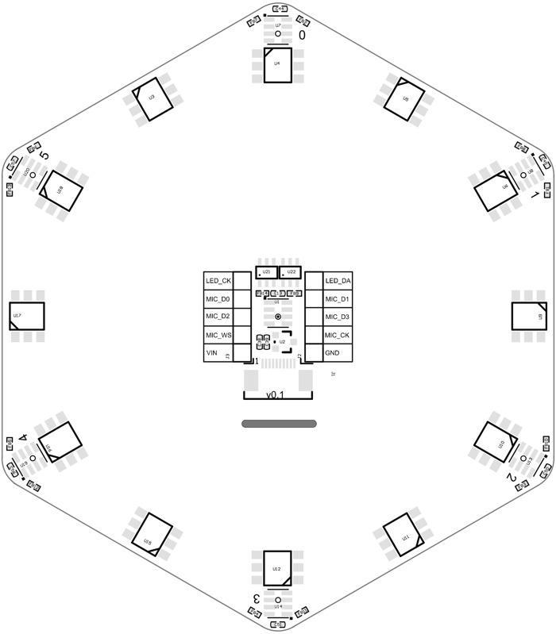

# Mic Array DOA

基于 ALINX AX7020（Zynq-7020）与 6+1 数字麦克风阵列的实时声源测向项目，面向**单声源、上半空间**，输出方位角和俯仰角。按本文接好阵列、构建 `BOOT.BIN` 并写入 TF 卡后，开发板上电即自动测向，结果显示在 HDMI 屏幕和阵列灯环上。

- **PL**：七路麦克风同步采集、AXI DMA、SK9822 灯环及 HDMI 720p60 输出。
- **PS 核 0**：扫频检测、匹配滤波与 SRP-PHAT 测向，控制灯环。
- **PS 核 1**：实时频谱、方向雷达、轨迹和数值显示，通过共享内存接收测向结果。

当前实时演示使用周期性 500–6000 Hz 扫频信号；接收强度用于相对远近显示，不提供绝对距离。HDMI 逻辑画布为 640×360、16 色，画面由 PL 放大输出至 1280×720。



## 快速开始

已经装好 Vivado/Vitis 2025.2 的 Windows 电脑上，按以下步骤从源码跑到屏幕上出现方向：

1. 按[接线](#接线)把麦克风阵列接到 AX7020 的 J11。
2. 在仓库根目录构建：
   ```powershell
   powershell -ExecutionPolicy Bypass -File scripts\build.ps1 -OutputDir build\first
   ```
3. 把 `build\first\BOOT.BIN` 复制到 FAT32 格式 TF 卡的根目录，插入开发板，J13 跳帽选 SD 卡启动。
4. 接上 HDMI 显示器，给开发板上电。
5. 用手机播放扫频音（生成方法见[播放扫频测试音](#播放扫频测试音)），屏幕上的雷达显示手机方向。

没有 Vivado/Vitis 时，可以在 Linux 上用开源工具链完成第 2 步，见[用开源工具链构建 BOOT.BIN](docs/open-toolchain.md)。

## 接线

整套系统需要连接四样东西：麦克风阵列、电源、HDMI 显示器，以及用于查看日志的串口（可选）。

### 麦克风阵列到 J11

阵列使用 [Sipeed 6+1 麦克风阵列](https://wiki.sipeed.com/hardware/zh/modules/micarray.html)：六颗 I2S 数字麦克风位于正六边形顶点、一颗位于中心，外圈半径 40 mm，灯环为 12 颗 SK9822。阵列中央的 2×5 排针（丝印分 J2、J3 两列）接到 AX7020 40 针扩展口 **J11** 的第 1～10 针，按下表用 10 根杜邦线逐一连接：阵列丝印 **GND** 接 J11 第 1 针，**VIN** 接第 2 针，依此类推。J11 的 1 号针在开发板丝印上有标示。

<p>
  
  
</p>

阵列照片与装配图来自 [Sipeed Wiki](https://github.com/sipeed/sipeed_wiki)，采用 MIT 许可，见 [THIRD_PARTY_NOTICES.md](THIRD_PARTY_NOTICES.md)。

| J11 针号 | 阵列丝印 | FPGA 管脚 | 说明 |
|---|---|---|---|
| 1 | GND | — | 地 |
| 2 | VIN | — | 阵列板 5 V 供电，板上 LDO 转 3.3 V |
| 3 | MIC_CK | F17 | I2S 位时钟，1.0417 MHz |
| 4 | MIC_WS | F16 | I2S 字时钟，采样率 16276.04 Hz |
| 5 | MIC_D3 | F20 | 中心麦克风 M6 |
| 6 | MIC_D2 | F19 | M4（左声道）、M5（右声道） |
| 7 | MIC_D1 | G20 | M2、M3 |
| 8 | MIC_D0 | G19 | M0、M1 |
| 9 | LED_DA | H18 | SK9822 灯环数据 |
| 10 | LED_CK | J18 | SK9822 灯环时钟 |

管脚约束见 [`hw/constr/mic_array_j11.xdc`](hw/constr/mic_array_j11.xdc)。J11 所在的 Bank 35 为 3.3 V，与阵列电平一致。

阵列须**麦克风进声孔朝上**水平放置。装配图外圈丝印 0～5 即 M0～M5，从进声孔一面看按顺时针排列，中心麦克风为 M6。输出角度的约定如下：

- **方位角**：M0 方向为 0°，从上方看逆时针增大。
- **俯仰角**：阵列平面为 0°，正上方为 90°。俯仰 ≥85° 时只输出俯仰，方位无意义。

阵列离桌面、墙面越远，反射越少，测向越稳定。本项目实测时，阵列高出开发板约 20 cm。

### 电源、HDMI 与串口

开发板本身的接口位置见 [ALINX AX7020 产品页](https://www.alinx.com/detail/273) 与[用户手册](https://alinx.com/public/upload/file/AX7020_UG.pdf)。

- **电源**：使用开发板自带的 DC 5V 电源。
- **HDMI**：开发板 HDMI 接口接显示器，固定输出 1280×720 @ 60 Hz。
- **串口（可选）**：板载 Micro USB 转串口接电脑，参数 115200 8N1，用于查看启动日志和逐次测向结果。

## 构建

构建依次生成 PL 比特流和两个 A9 裸机程序，再用 bootgen 打包成 `BOOT.BIN`。有两种方式，得到的 `BOOT.BIN` 功能相同：

| 方式 | 平台 | 说明 |
|---|---|---|
| Vivado/Vitis | Windows | 下文步骤；一次完整构建约 6 分钟 |
| 开源工具链 | Linux | 不需要安装 Vivado/Vitis，见[用开源工具链构建 BOOT.BIN](docs/open-toolchain.md)；一次完整构建约 2 分钟，已上板验证 |

### 用 Vivado/Vitis 构建

开始前，你需要：

- Windows 上的 **Vivado 与 Vitis 2025.2**，其中含 bootgen 和 ARM 工具链。Vivado/Vitis 和 AMD/Xilinx IP 不随源码分发。
- 一个全新的输出目录。软件阶段会在其中创建 Vitis 工作区；如果目录里已有 `vitis\`，脚本会拒绝继续。

在仓库根目录运行：

```powershell
powershell -ExecutionPolicy Bypass -File scripts\build.ps1 `
  -OutputDir build\release `
  -Vivado C:\AMDDesignTools\2025.2\Vivado\bin\vivado.bat `
  -Vitis C:\AMDDesignTools\2025.2\Vitis\bin\vitis.bat `
  -ArmToolchain C:\AMDDesignTools\2025.2\Vitis\gnu\aarch32\nt\gcc-arm-none-eabi\bin
```

把三个路径换成你本机的 Vivado/Vitis 安装位置。如果 `vivado.bat`、`vitis.bat` 和 `arm-none-eabi-nm.exe` 已在 `PATH` 中，可以省略对应参数。

构建成功时，最后几行输出为：

```text
MIC_SD_BOOT_IMAGE_OK
Build complete: <仓库路径>\build\release
```

输出目录中的主要文件：

| 文件 | 用途 |
|---|---|
| `BOOT.BIN`、`BOOT.BIN.sha256` | TF 卡启动镜像及其校验值 |
| `top.bit`、`top.xsa` | PL 比特流与硬件描述 |
| `fsbl.elf`、`app.elf`、`display.elf` | FSBL、CPU0 测向程序、CPU1 显示程序 |
| `timing.rpt`、`utilization.rpt` | 时序与资源报告 |

`-Stage` 用于分阶段构建，默认为 `all`：

| 取值 | 作用 |
|---|---|
| `all` | 硬件、软件、`BOOT.BIN` 全部构建 |
| `hw` | 只运行 Vivado，生成 `top.bit`、`top.xsa` |
| `sw` | 只构建两个 A9 程序和 `BOOT.BIN`；输出目录中必须已有同一次构建的 `top.xsa` |
| `boot` | 只用输出目录中已有的文件重新打包 `BOOT.BIN` |

修改了 `hw/` 下的任何文件，都必须用 `-Stage all` 或 `-Stage hw` 重新构建硬件，不能复用旧的 `top.xsa`。PS 的 SD 卡控制器配置就在硬件描述里：`sw/build.py` 会检查 `top.xsa` 中是否启用了 SD0（MIO40–45、卡检测 MIO47），缺少时报 `SD hardware mismatch` 并停止。

## 烧录

烧录就是把 `BOOT.BIN` 放进 TF 卡，程序不写入开发板上的 QSPI Flash。换回旧卡或删除这个文件即可还原。

### 写入 TF 卡

开始前，准备一张 TF 卡。第一个分区须为 FAT32，容量 1 GB 以上即可。

1. 把构建输出中的 `BOOT.BIN` 复制到 TF 卡第一个分区的根目录，文件名必须是 `BOOT.BIN`。
2. 安全弹出 TF 卡，插入开发板的 TF 卡座。
3. 把核心板 J13 跳帽设为 **SD Card** 启动。按 ALINX AX7020 教程表 4-1，跳帽连接左边两个引脚是 SD 卡启动，中间两个是 QSPI，右边两个是 JTAG。
4. 接好 HDMI 显示器后给开发板上电。

上电后，FSBL 加载比特流和两个程序，自检通过即显示雷达界面并开始测向，无须操作串口。串口上可以看到以下日志，确认自检通过、两个核都已启动：

```text
MICARRAY DEMO v5 AX7020: CPU0 capture/DOA + CPU1 radar/FFT + PL HDMI
BOOT mode=5 autostart=1
SELFTEST PASS: all 7 words, sequence, packet and tail lengths
AUTOSTART CPU1_READY: starting chirp DOA, LED and HDMI
CHIRP_START fs=16276.041667 band=500:6000 pulse_ms=20 period_ms=300 q=stop mapping=verified_identity
```

如果出现 `ERROR autostart blocked by capture selftest`，说明七路麦克风数据异常，程序会停在串口菜单，不进入测向。这时检查 J11 的接线和阵列供电。

### 播放扫频测试音

测向对象是周期性扫频音：每 0.3 s 一段 20 ms、500～6000 Hz 的线性扫频。用 Python 生成 WAV 文件，拷到手机上循环播放：

```bash
python -m venv .venv
.venv/bin/python -m pip install -r requirements-tools.txt
.venv/bin/python tools/make_chirp_wav.py --seconds 60 --out chirp_train.wav
```

预期输出：

```text
chirp_train.wav: 60 s, 20 ms chirps 500-6000 Hz every 0.3 s
```

播放时，手机扬声器朝向阵列。每识别一段扫频，串口输出一行结果，例如：

```text
CHIRP seq=681802 status=OK az=245 el=47 level_dbfs=-46.12 snr=43.8 quality=0.9773 gate_delta=2.00 latency_ms=152.7
```

`status=OK` 表示结果通过了质量门限，屏幕和灯环随之显示方向。其他状态（如 `MODEL_MISMATCH`、`AMBIGUOUS_ONSET`）表示该段被拒绝，不显示方向。

只有扫频音能得到 `status=OK`。静音、白噪声和持续单音不会被检出；拍手等其他宽带声音会被检出，但通常以 `MODEL_MISMATCH` 被拒绝。

### 通过 JTAG 临时加载（可选）

调试时可以不写 TF 卡，直接把构建结果经 JTAG 下载到 DDR 运行，断电即失效。这一流程只在 Linux 上验证过。

开始前，你需要：

- 把 J13 跳帽设为 **JTAG** 启动。开发板在 SD 卡模式下运行时再经 JTAG 重新加载，会中断 PL 的 AXI 访问，导致总线挂死。
- 安装 OpenOCD 0.12（含 FTDI 支持）和 `arm-none-eabi` binutils，并确保 `openocd`、`arm-none-eabi-nm`、`arm-none-eabi-objdump`、`arm-none-eabi-readelf` 在 `PATH` 中。
- 用 USB 线连接开发板的 JTAG 口和串口，并安装 `requirements-tools.txt` 中的依赖。
- 准备一份构建输出目录，其中须有 `fsbl.elf`、`top.bit`、`app.elf`、`display.elf`，Windows 上构建的目录可以直接拷过来。

加载：

```bash
.venv/bin/python scripts/board.py flash --build BUILD_DIR
```

把 `BUILD_DIR` 换成构建输出目录，例如 `build/release`。脚本通过 FSBL 初始化 PS、下载比特流和两个程序，并把程序里的自启动开关写为 0，让开发板停在串口菜单而不自动测向。如果程序带有 CPU1 唤醒代码却找不到这个开关，脚本会报错并拒绝下载，防止 CPU0 去唤醒调试器正在控制的 CPU1。

加载成功后，串口停在 `READY frames=16384 ...` 菜单。常用命令：

| 按键 | 作用 |
|---|---|
| `b` | 开始扫频测向，驱动灯环与 HDMI |
| `q` | 停止测向并打印统计 |
| `e` | 采集 20 秒原始七路数据到 DDR |
| `i` | 查看 CPU1 与 HDMI 状态 |

`scripts/board.py capture --seconds 20 --out OUT_DIR` 可以采集原始数据并经 JTAG 导出为 `OUT_DIR/capture.bin`，每帧 32 字节：七个 24 位有符号样本各占一个 32 位字的高 24 位，第八个字为帧序号。如果开发板正在测向，脚本会先发送 `q` 停止测向。

默认 OpenOCD 配置 [`scripts/openocd/ax7020.cfg`](scripts/openocd/ax7020.cfg) 适用于开发板板载 FT232H JTAG。电脑上连着多个 FTDI 设备时，在其中加一行 `adapter serial <你的适配器序列号>`。

## 源码目录

| 目录 | 内容 |
|---|---|
| `hw/` | PL RTL、引脚约束、DDR 配置、Vivado 构建脚本及视频编码依赖 |
| `hw/oss/` | 开源流程的顶层、Xilinx IP 的 Verilog 替代实现、约束与构建脚本 |
| `sw/` | 双 Cortex-A9 裸机程序、算法、显示资源、Vitis 构建脚本与启动镜像描述 |
| `sw/bsp/` | 开源流程使用的 embeddedsw BSP、驱动、FSBL 与链接脚本 |
| `sw/qemu/` | 不接开发板、在 QEMU 中检查 SD 卡启动过程的脚本 |
| `scripts/` | Windows 构建入口、开源 bootgen 编译脚本，Linux 下的 JTAG 加载与采集工具 |
| `tools/` | 扫频测试音生成、显示资源生成；显示资源已生成为 C 头文件 |
| `licenses/` | 第三方许可证与版权声明 |

重新生成显示资源需要 `requirements-assets.txt` 中的依赖，以及 Noto Sans CJK 和 DejaVu Sans Mono 字体（可用 `MIC_CJK_FONT`、`MIC_MONO_FONT` 指定路径）。

## 许可证

本项目原创代码采用 [MIT License](LICENSE)。第三方代码及字体相关资源保留各自协议，详见 [THIRD_PARTY_NOTICES.md](THIRD_PARTY_NOTICES.md)。
